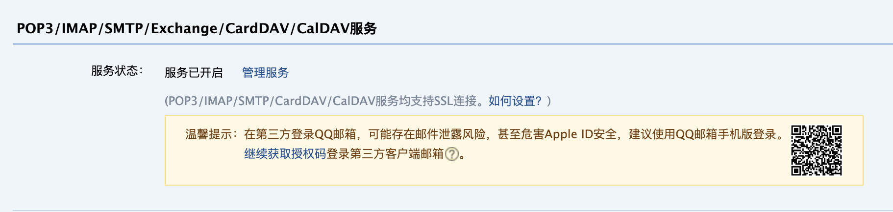
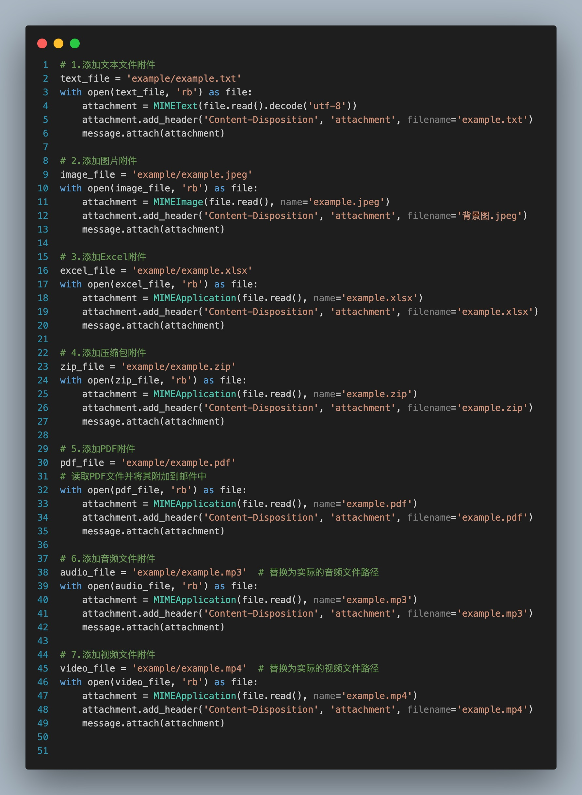
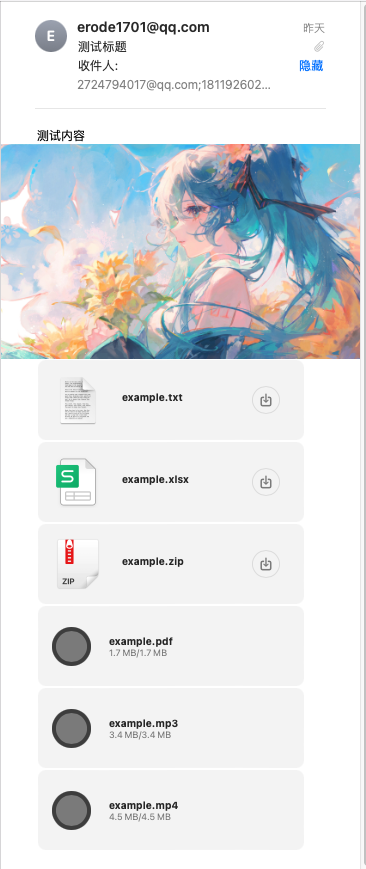

# 用Python发送邮件的小脚本

## 用Python发送邮件的小脚本
本仓库是一个使用Python发送邮件的示例，可以发送文本文件，图片，Excel文件，压缩包，PDF，音频和视频。
发送时需要SMTP服务器和邮箱信息，你可以从邮件服务商（如QQ邮箱、163邮箱等）获取。
注意这里的密码其实是邮箱的授权码，而不是邮箱的登录密码。这里我使用的是qq邮箱，注意你需要在邮箱设置中找到账号这一项，然后在 **_POP3/IMAP/SMTP/Exchange/CardDAV/CalDAV服务_** 这一项中开启服务，然后获取授权码。

授权码才是下面代码中你的登陆的密码

## example文件夹
example的文件是我测试发送文本文件，图片，Excel文件，压缩包，PDF，音频和视频的一些文件。
没有尝试PPT，word文档等，但估计应该也是可以发送的。


## email.py、send-email.py文件
email.py和send-email.py这两个文件其实是一样的，任意一个都是能发邮件的。我是首先写了send-email.py，感觉发送附件的时候不方便，所以把发送图片，文本文件，pdf,excel,mp3,mp4的部分封装成了三个函数,如何只需要把文件对应的路径作为参数传进去就好了，可能会方便一点点。
除了图片和txt文本使用`send_img(image_file_path)`和`send_text(text_file_path)`，
其余的都使用`send_application(file_path)`函数。
```python
server.set_mail_title('测试标题')      # 设置标题,标题传入一个字符串就行
server.set_mail_content('测试内容')    # 设置邮件的文本内容，文本内容也是一个字符串
server.send_img(image_file)           # (可选) 传入图片的路径
server.send_text(text_file)           # (可选) 传入文本的路径
server.send_application(excel_file)   # (可选) 传入其他类型的文件的路径
```
这段其实就是下面函数的封装


## 效果展示
